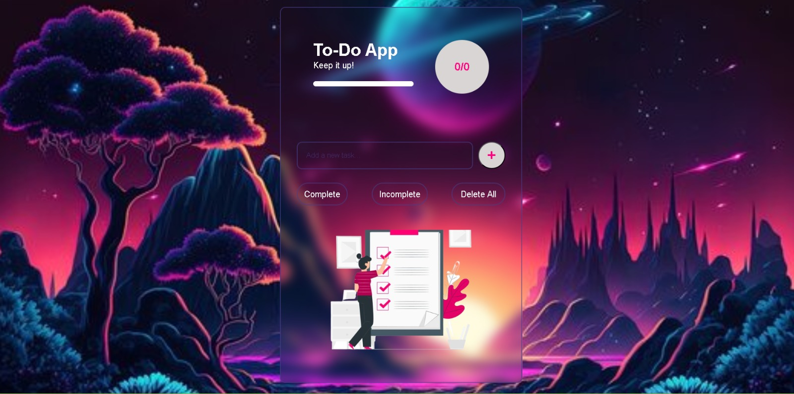

# TODO-LIST

## Developer Information
**Name:** Vivek V Nair  
**Company:** CodTech IT Solutions  
**Domain:** Web Development  
**Duration:** June to July 2024  

## Project Overview
Welcome to the To-Do Web Application! This project is a simple yet effective task management tool built with HTML, CSS, and JavaScript.



[Live Demo]([https://to-do-web-application-eight.vercel.app/](https://todo-list-alpha-pied.vercel.app/))

## CRUD Operations
- **CREATE:** Add new tasks effortlessly.
- **READ:** View all tasks with options to filter by completion status.
- **UPDATE:** Edit tasks to update their content.
- **DELETE:** Remove individual tasks or delete all tasks at once.

## Key Features
- **CRUD Operations:** Add, show, edit, delete tasks effortlessly.
- **Task Completion:** Mark tasks as completed or pending.
- **Filtering:** Filter tasks to view only completed or pending items.
- **Progress Tracking:** A dynamic progress bar to monitor task completion.
- **Persistent Storage:** Tasks are saved in local storage, ensuring they persist even after a browser refresh.

## Technologies Used

### Frontend
- **HTML5:** Provides the structure of the web application.
- **CSS3:** Styles the application, making it visually appealing and user-friendly.
- **JavaScript (ES6):** Adds interactivity and dynamic functionality to the application.

### Storage
- **Local Storage:** Stores tasks in the browser's local storage to ensure persistence across sessions.

### Development Tools
- **Visual Studio Code:** A code editor used for development.

## Run Locally
1. **Clone the project**
    ```sh
    git clone https://github.com/viveknair6915/TODO-LIST.git
    ```
2. **Go to the project directory**
    ```sh
    cd todo-web-application
    ```
3. **Open the `index.html` file in your preferred web browser.**

That's it! The application should now be running locally on your machine.
